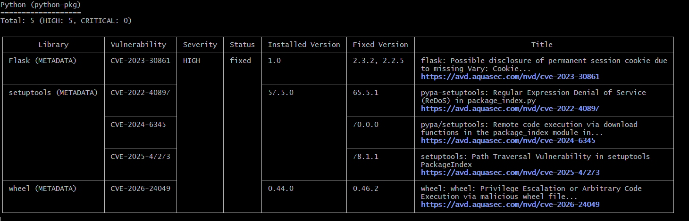
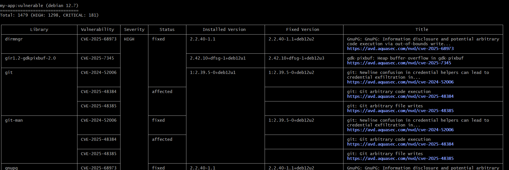
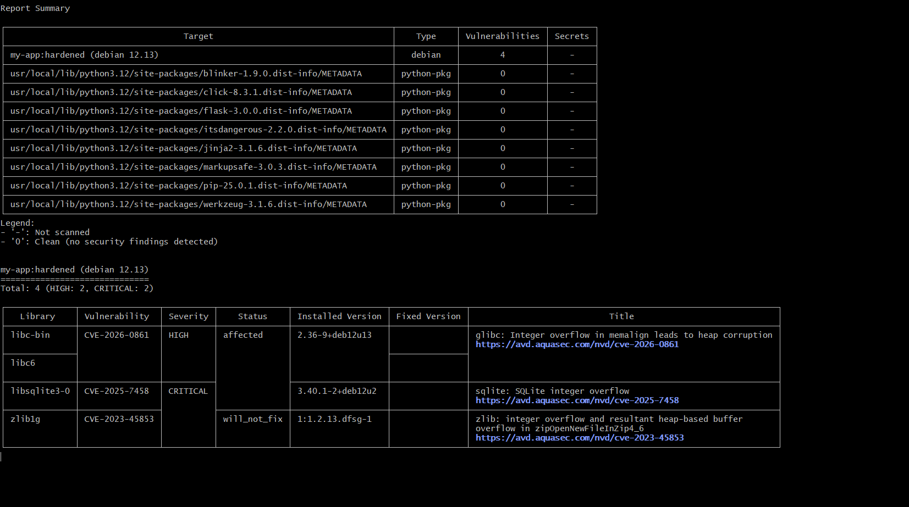
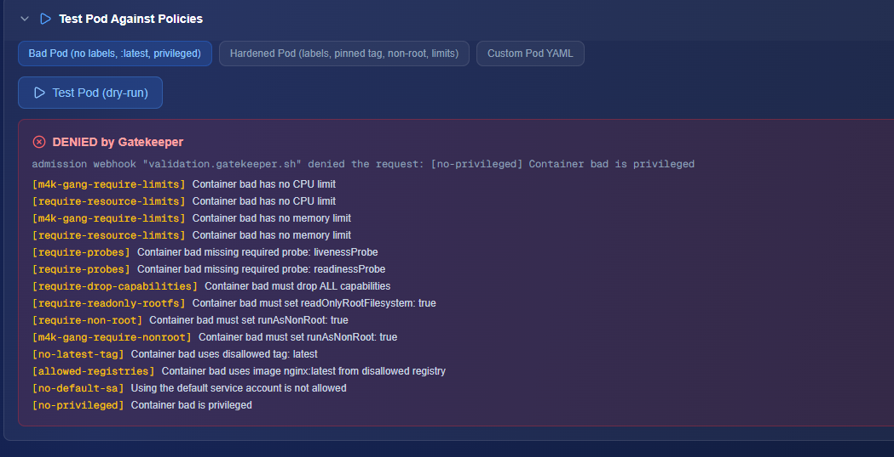
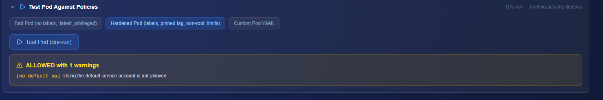

## Lab 2: Container Security


I denna labb har jag undersökt och förbättrat säkerheten i en containeriserad Flask-applikation. Labben innehöll följande steg:

Skannade en sårbar Docker-image med Trivy för att identifiera kritiska CVE:er.

Härdade Dockerfilen genom att byta till en nyare, mindre Python-image, använda en non-root user, uppdatera Flask-versionen och lägga till --no-cache-dir vid installation av beroenden.

Genererade en Software Bill of Materials (SBOM) med Trivy för att dokumentera alla komponenter i containern.

Testade policy-enforcement med OPA Gatekeeper i Kubernetes för att säkerställa att pods följer krav på labels.

Signering med Cosign - Säkerställer att endast signerade images används i produktionsmiljö och gör det möjligt att verifiera integritet och äkthet av images.

Reflekterade över container-säkerhet, vikten av SBOM och hur Gatekeeper påverkar arbetsflöden i Kubernetes.

---


### Verktyg som användes

Docker – för att bygga och köra containrar.

Trivy – för sårbarhetsskanning och SBOM-generation.

Flask – enkel Python web-applikation.

OPA Gatekeeper – för policy-enforcement i Kubernetes.

kubectl – för att interagera med klustret.

cosign - Image-signatur, verifiering, integritet.

# Lab 2: Container Security

## Filstruktur
```text
lab2-container-security/
├── Dockerfile.vulnerable
├── Dockerfile.hardened
├── app.py
├── requirements.txt
├── sbom.json
├── scan-before.txt
├── scan-after.txt
├── policies/
│   ├── require-imagepullpolicy-template.yaml 
│   ├── require-imagepullpolicy.yaml   
│   ├── require-resource-limits-template.yaml
│   ├── require-resource-limits.yaml
│   ├── require-labels-template.yaml
│   └── require-team-label.yaml
├── README.md
└── screenshots/
    ├── trivy-before.png
    ├── trivy-after.png
    ├── gatekeeper-deny.png
    └── gatekeeper-pass.png
```


---

Screenshot Trivy-before-1
  
Screenshot Trivy-before-2

Screenshot Trivy-after
  
Screenshot gatekeeper-deny

Screenshot gatekeeper-pass


---

## Reflektion
Under labben lärde jag mig att container-säkerhet handlar om mer än att bara köra applikationer. 
Det handlar också om att minska sårbarheter i både basimages och applikationsberoenden. 
Jag såg att en äldre Flask-version och ett fullständigt Python-image hade flera kritiska CVE:er som Trivy kunde hitta. 

Genom att härda Dockerfilen med en nyare, slim-version av Python och en non-root user blev containern säkrare och attackytan mindre. 
SBOM var väldigt användbart för att få en översikt över alla komponenter i containern, vilket gör det enklare att snabbt reagera på nya sårbarheter. 

Policy-enforcement med Gatekeeper förändrar också hur man jobbar med Kubernetes, eftersom den automatiskt blockerar resurser som inte följer regler. 
Det tvingar utvecklare att tänka på säkerhet redan vid deployment. Att se hur en "Bad Pod" nekades och en "Hardened Pod" godkändes gav en tydlig bild av hur policies påverkar verkliga deployment.
